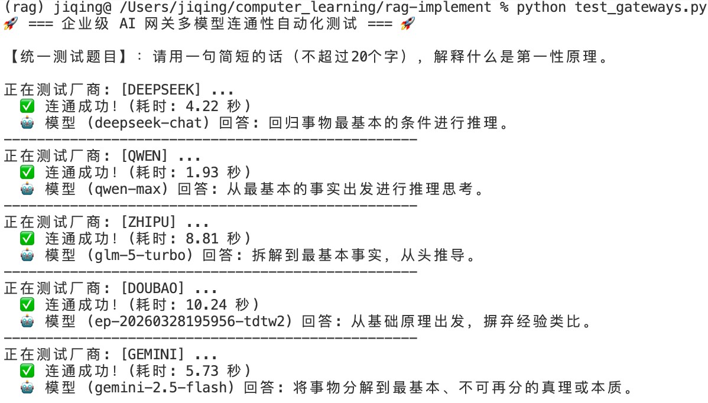
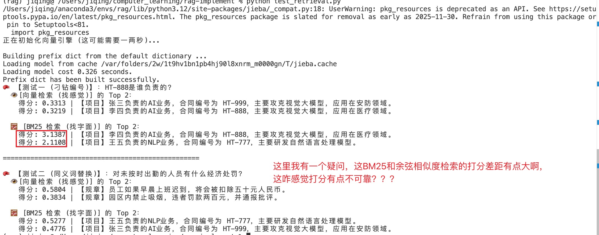
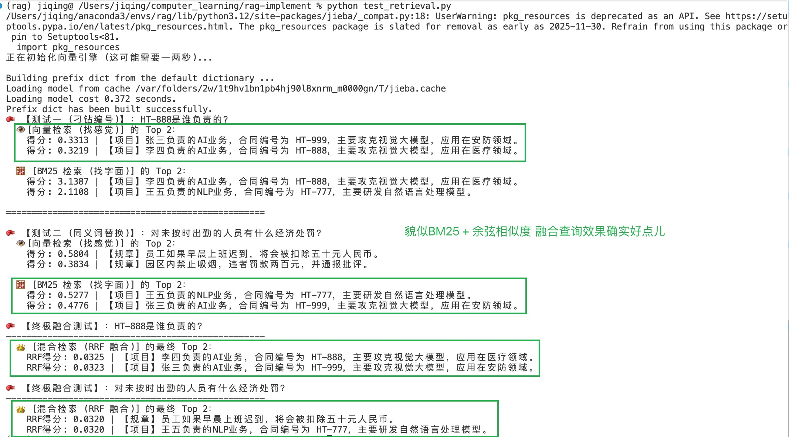

# stage1困惑
- 手写实现了最初版的RAG，我依然有许多的困惑。
- 怎么选embedding模型？
- 怎么评价衡量不同的embedding模型的能力？
- 除了余弦向量相似度检索之外，还有没有其他的检索方法？怎么衡量不同的检索方法的效果？
- 怎么衡量增强阶段的提示词的效果？
- 怎么衡量不同厂家模型在我们的任务的效果？

# stage1观察
1. 而且我观察到不同的模型回复的时间长短并不一致，有的时间10秒，有的时间1秒

2. 这BM25和余弦相似度的打分差距有点大啊，看着不咋可靠？？？？

于是乎让AI又看了一下，这BM25和余弦相似度的打分不能互相比较，只在各自的排名里可靠，然后AI又给我搞了个RRF融合BM25和余弦相似度。这么主观来看，对于不同类型的问题，融合的貌似还真有效果。

# AI解答记录
## 一、 关于 Embedding 与检索（R）的度量
### 1. 怎么选 Embedding 模型？   
不要看厂家的营销广告，直接去看开源界的权威榜单：MTEB (Massive Text Embedding Benchmark) Leaderboard。
在选型时，只看三个核心指标：
- 多语言/中文能力： 选专门针对中文优化的（如智源的 BGE 系列、阿里的 GTE、微软的 E5）。
- 上下文窗口（Max Tokens）： 有的模型最多只能吃 512 个 Token 的切片，如果你切的 Chunk 比较大，就会被强行截断，丢失语义。
- 向量维度（Dimensions）： 维度越高（如 OpenAI 的 1536 维），捕捉语义越细，但存储成本和计算耗时也呈指数级上升。如果是中小企业，通常用 512 维或 768 维的开源模型性价比最高。

### 2. 怎么衡量不同 Embedding 模型的效果？

### 3. 除了余弦相似度，还有没有其他检索方法？怎么衡量效果？
单纯的“余弦相似度（纯语义搜索）”在企业里是不够用的。比如用户搜“合同编号 HT-2026-001”，语义模型往往会懵，因为它不懂精确的数字编号。

其他检索方法： 工业界最成熟的替代方案是 BM25 算法（传统的关键词/词频倒排索引检索）。企业级终局方案是 “混合检索（Hybrid Search）” = BM25（抓精确关键词） + 向量余弦（抓模糊语义）。

### 4.如何衡量它们的检索效果？（信息检索领域的经典指标）：
我们需要构建一批测试问题，并提前人工标注好“这个问题应该对应哪几个 Chunk”。
- Hit Rate（命中率）： 检索出来的 Top-K（比如前5个）结果中，是否包含了正确答案所在的那个 Chunk？包含了就是 1，没包含就是 0。
- MRR (Mean Reciprocal Rank，平均倒数排名)： 正确的 Chunk 排在第几位？排第 1 得 1 分，排第 2 得 0.5 分，排第 3 得 0.33 分，没找着得 0 分。
- 评估方式： 用同一批测试题，分别跑通义的 Embedding、DeepSeek 的 Embedding，或者 BM25 检索，看谁的 MRR 分数高，谁就是更适合你们公司业务的数据模型。

## 二、 关于提示词（A）的度量
### 5. 怎么衡量增强阶段的提示词（Prompt）的效果？
提示词工程本质上是“控制大模型的注意力”。
要衡量提示词好不好，工业界目前普遍采用 “A/B 测试 + 核心指标观察”：
- 上下文精确度 (Context Precision)： 我们塞进去的情报（Context）里，到底有多少是真正有用的？如果提示词没有很好地约束模型，模型就会被无用的噪音带偏。
- 忠实度 (Faithfulness / 幻觉率)： 极度关键！对比大模型的回答和我们喂给它的 Chunk。如果大模型的回答里，出现了 Chunk 里根本没有的信息，这就是幻觉，忠实度扣分。一个好的提示词（比如加了“请你严格基于参考情报，如果不知道请直接回答不知道”），能将幻觉率压低到 5% 以下。

## 三、 关于大模型（G）的度量
### 6. 怎么衡量不同厂家模型在我们任务上的效果？
你刚才跑测试脚本，看到各家耗时不同，这只是工程指标（延迟、吞吐量、成本）。
要衡量业务质量指标，传统的做法是让人工去给回答打分，但这成本太高且不可复利。

现在工业界最前沿的终极方案是：LLM-as-a-Judge（用魔法打败魔法）。

构建黄金测试集 (Golden Dataset)： 准备 100 个真实的业务问题，并由业务专家写出 100 个“标准完美答案（Ground Truth）”。

自动化打分： 让 Qwen、DeepSeek、Gemini 分别回答这 100 个问题。然后，我们调用一个公认最强的模型（比如 GPT-4o 或 Claude 3.5 Sonnet）作为“裁判”。

裁判的维度：
Answer Correctness（答案正确性）： 候选模型的回答，和专家的标准答案相比，意思是否一致？有无遗漏关键点？

## 破局的关键：建立“黄金测试集”
看透了上面这三点，你会发现：无论是评估 Embedding、测试 BM25 算法、调优提示词，还是选型大模型，所有的基础都建立在你必须拥有一份“黄金测试集（Golden Dataset）”上。

这份测试集通常是一个 CSV 文件，包含三列：
- question（真实业务问题）
- ground_truth_context（这个问题理应召回的正确切片原文）
- ground_truth_answer（这个问题理应输出的完美答案）

有了这个数据集，你就拥有了衡量一切的标尺。你改动一行代码，或者换了一个 API，只要跑一遍自动化评估脚本，系统就会自动算出 MRR、忠实度、正确性的分数。分数涨了，你的改动就是对的；分数跌了，立刻回滚。这就是复利思维在工程中的体现。