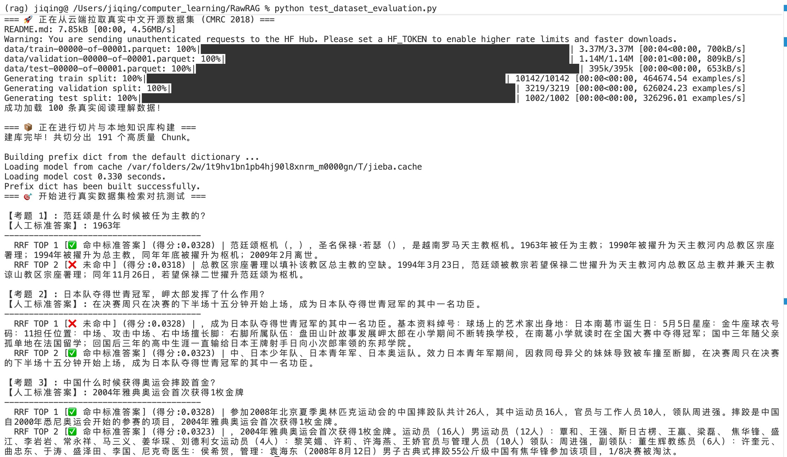
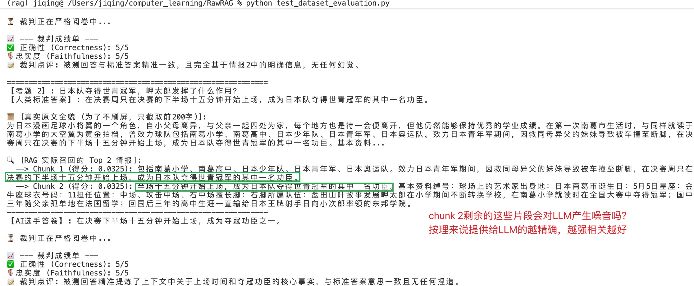
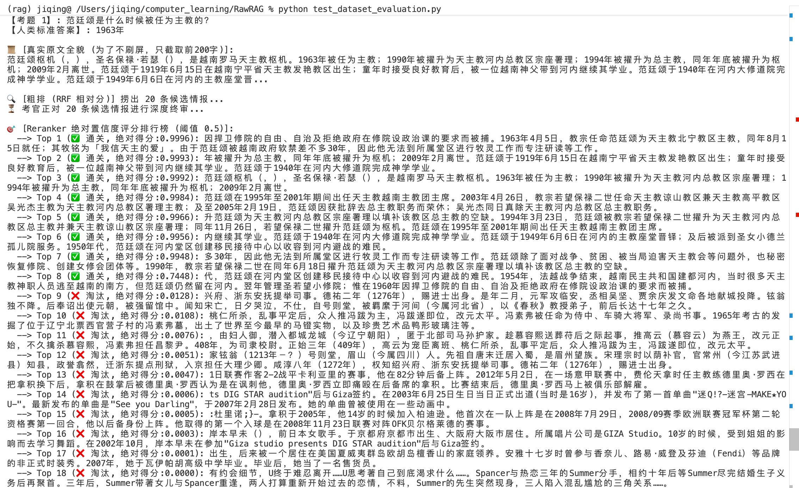

下载 HuggingFace 上非常经典的 CMRC 2018 (中文机器阅读理解数据集) 作为我们的“试金石”。它的结构极其干净：上下文、问题、标准答案。

## Question 

### 问题1:检索的片段数top-k这里的k怎么设定？
突然想到一个问题，召回的相关内容的片段top-k这里的k怎么设定呢？我又不知道向量库里相关内容到底有多少，而且不同的问题相关的内容片段数量肯定也不一致，k的选择也是一个很关键的问题啊。k选大了传一些和问题关联很低的数据给LLM，变成了噪音误导LLM，选的小了又检索的不全面，LLM参考信息不足。固定的 Top-K 是有点反逻辑的，如何实现动态 K？

AI回答：
**手段1: “断崖法 (The Elbow Method / Score Drop-off)”** 
如果你观察过检索出来的分数排序，你会发现一个极其普遍的规律。   
假设召回了 10 条数据，它们的分数分布往往是这样的：   
[0.92, 0.90, 0.88, 0.45, 0.42, 0.40...]   
你会发现，前三名和第四名之间，存在一个极其陡峭的**“分数断崖”**。这个断崖就是数学在向你疯狂暗示：从第 4 名开始，全都是不相关的噪音！

可以引入动态断崖截断算法（如hybrid_retiever.py中的dynamic_k_cutoff函数所示）
优点：计算成本为零，极度轻量。   
缺点：RRF 融合后的分数下降通常比较平滑，断崖不一定特别明显。   

**手段2: “跨源重排序阈值 (Cross-Encoder Reranker)”**
- 用咱们的 HybridRetriever 先无脑捞出 Top 20。
- 丢给 Reranker 模型重新打分。
- 设置硬性阈值： 凡是 Reranker 给出的置信度分数 < 0.5 的，全部当垃圾扔掉。剩下的有几条算几条。如果一条都没有，说明库里压根没答案。

引入Reranker之后还真不赖啊，另一个样例的结果就不粘贴了，但是观察结果其实有一个很明显的发现，根据置信度选出Top-p置信度的这种就是动态k的。除此之外，我发现两个例子中的绝对得分在排行榜这里有一个断崖式下降，从0.6175到0.0075，还有另一个是从0.6175到0.0750。

这个断崖不仅极其可靠，而且是算法工程师在训练 Reranker 时梦寐以求的“极化效应（Polarization）”。

我们用第一性原理来拆解，为什么 Reranker 的分数会像瀑布一样，从 0.6 瞬间砸到 0.00 几。
罪魁祸首：Sigmoid 激活函数。我们之前用的“向量余弦相似度”，计算的是几何夹角，它的分数下降是非常平滑、线性的（比如 0.9, 0.8, 0.7...）。但 BGE-Reranker 是一个分类器（Classifier）。当它把问题和一段文本进行深度交叉运算后，它在神经网络的最末端输出的并不是 0 到 1 的概率，而是一个没有上下限的实数，叫做 Logit（原始对数几率），比如 5.2 或者 -8.1。为了把这个无限大的数字变成人类能看懂的 0 到 1 的“置信度”，Reranker 在最后一步强制套用了一个极其经典的数学滤镜——Sigmoid 函数。

**手段3:大模型前置过滤 —— "LLM Filter"**
连 Reranker 都不信任。直接用一个极其便宜、极高并发的小模型（比如本地部署的 Qwen-1.5B 或者是极低价的 API），在组装最终 Prompt 之前，先让它做一遍“快筛”。
- 后台并发提问： “已知问题是【XXX】，请问情报【YYY】对回答这个问题有用吗？只回答 YES 或 NO。”
- 动态组装： 只把拿到 YES 的情报拼装给主模型（比如 DeepSeek-Chat）去生成最终答案。

### 问题2:切片的时候切片长度选多少合适呢？
